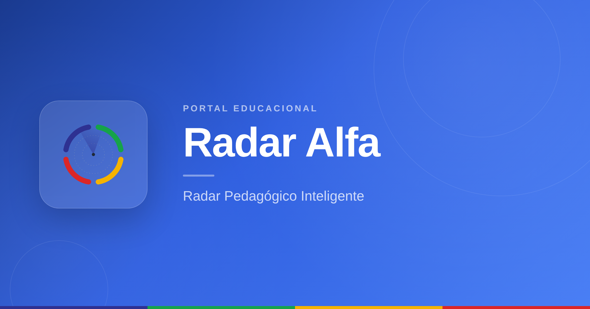
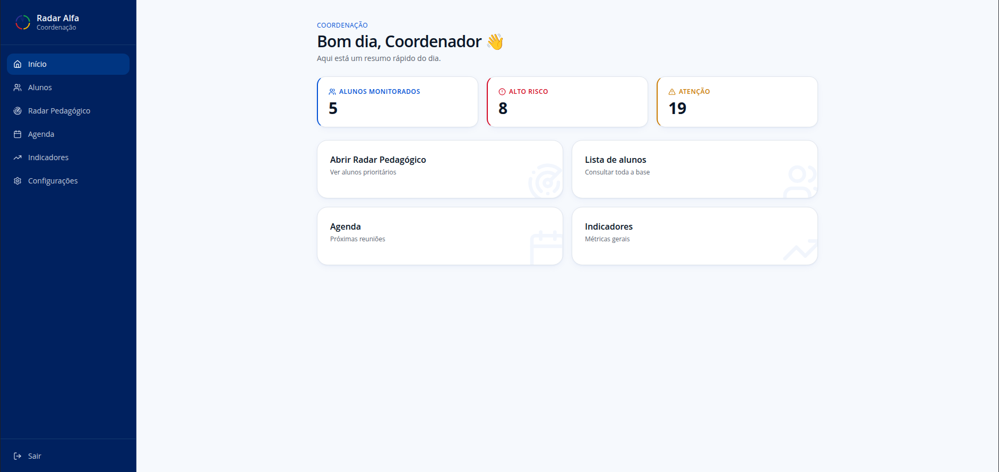
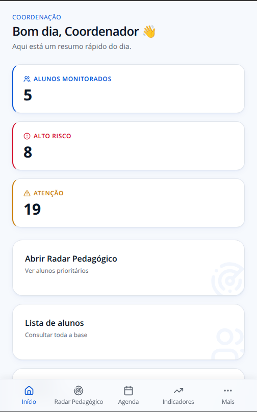
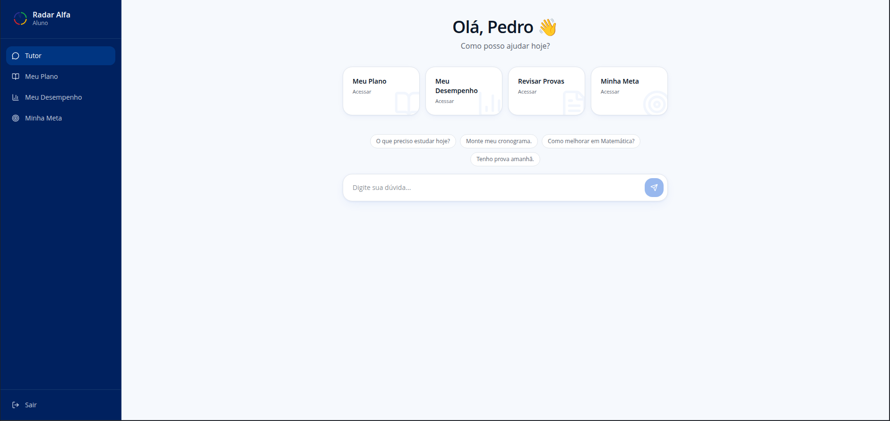
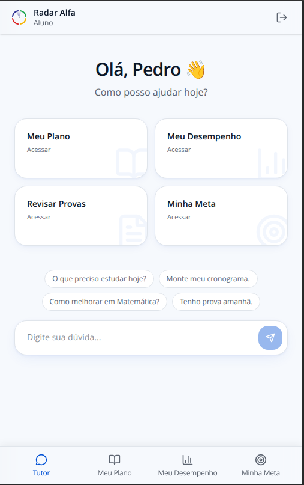
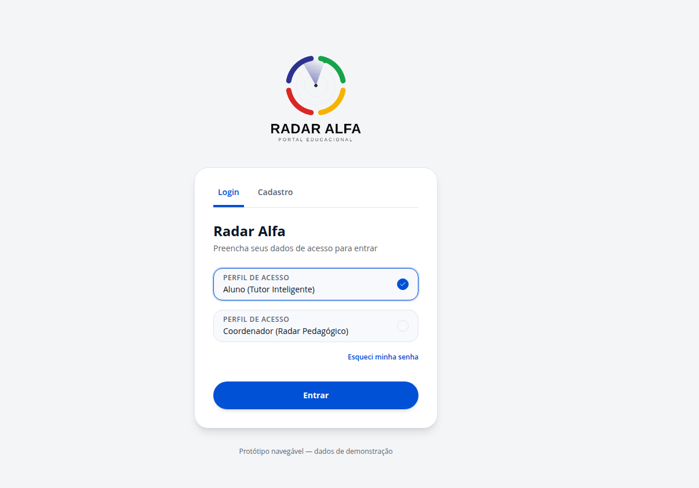

<div align="center">
  

  # Radar Alfa

  **Radar Pedagógico Inteligente para coordenação escolar e Tutor Inteligente para alunos**

  Protótipo navegável construído para demonstrar como IA pode antecipar riscos pedagógicos e apoiar o acompanhamento individual de cada aluno, dentro do ecossistema Plurall.

  
  
  
  

  
</div>

<br/>

## Sobre o projeto

O **Radar Alfa** reúne, em um único lugar, tudo o que a coordenação precisa saber sobre um aluno — frequência, notas, engajamento e comunicação com a família — e usa IA para sinalizar riscos e sugerir intervenções antes que o problema se agrave.

Do lado do aluno, o **Tutor Inteligente** funciona como um assistente de estudos: acompanha o plano da semana, o desempenho por matéria e as metas pessoais, respondendo dúvidas em um chat conversacional.

## Screenshots

### Portal do Coordenador

<div align="center">
  
  
</div>

### Portal do Aluno

<div align="center">
  
  
</div>

### Entrada

<div align="center">
  
</div>

## Funcionalidades

### Coordenador
- **Radar Pedagógico** — visão consolidada de todos os alunos, com classificação automática por nível de risco (alto risco / atenção / dentro do esperado)
- **Perfil do aluno** — índice pedagógico, motivos do alerta, sugestões de intervenção geradas por IA, e registro de ações tomadas
- **Histórico** — linha do tempo de intervenções e evolução do aluno
- **Indicadores** — métricas gerais da escola e desempenho por turma
- **Agenda** — compromissos e reuniões da semana

### Aluno
- **Tutor Inteligente** — chat conversacional que conhece o histórico escolar do aluno
- **Meu Plano** — cronograma de estudos da semana, com checklist de atividades
- **Meu Desempenho** — gráfico e comparativo de notas por matéria
- **Minha Meta** — acompanhamento de progresso rumo a um objetivo definido
- **Revisar Provas** — histórico de avaliações

## Stack técnica

| Camada | Tecnologia |
|---|---|
| Framework | React 19 + TanStack Router / Start |
| Estilo | Tailwind CSS v4 + shadcn/ui |
| Gráficos | Recharts |
| Persistência | localStorage (protótipo sem backend) |
| Feedback | Widget conectado ao Formspree |
| Qualidade visual | Auditado com [Impeccable](https://github.com/pbakaus/impeccable) — 0 problemas de contraste/acessibilidade |
| Deploy | Vercel |

## Rodando localmente

```bash
npm install
npm run dev
```

Acesse `http://localhost:8081` e escolha entre o perfil de Coordenador ou Aluno.

## Estrutura do projeto

```
src/
├── components/portal/     # Sidebar, PortalShell, FeedbackWidget
├── hooks/                 # useLocalStorage e afins
├── lib/                   # dados mockados (portal-data.ts)
├── routes/                # rotas do Coordenador (radar.*) e do Aluno (tutor.*)
└── styles.css              # design tokens (cores, sombras, tipografia)
```

## Status

Protótipo funcional e navegável, sem backend — todos os dados são mockados ou persistidos localmente via `localStorage`. Construído para apresentação e validação de conceito.

---
<div align="center">


Todos os direitos reservados.

Este projeto foi desenvolvido exclusivamente para fins de demonstração e apresentação educacional. Nenhuma parte deste código, design ou conteúdo pode ser copiada, modificada, distribuída ou utilizada para fins comerciais sem autorização expressa do autor.
  <sub>Copyright (c) 2026 Radar Alfa</sub>
</div>
